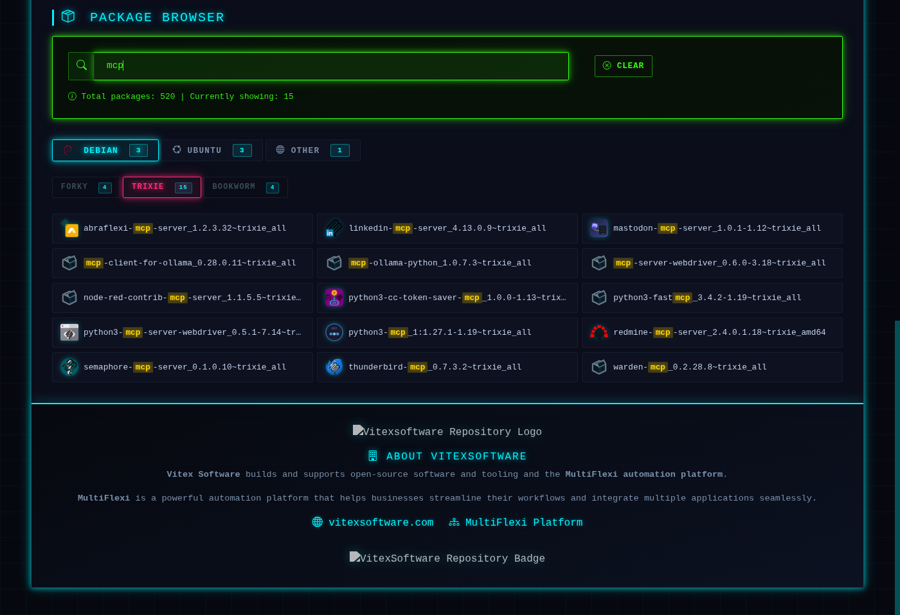

# deb-repo-toolkit

Ansible role + example CI pipelines for running your own self-hosted Debian/Ubuntu
apt repository, complete with GPG signing, AppStream (DEP-11) metadata so package
icons show up in software centers like GNOME Software and KDE Discover, and a
searchable Bootstrap 5 package-browser web page.

This is the same toolkit behind [repo.vitexsoftware.cz](https://repo.vitexsoftware.cz),
extracted and genericized so anyone can stand up the same thing for their own packages.



## What it does

- Manages [aptly](https://www.aptly.info/) repositories per distribution/release/component
  (`main`, `backports`, `games`, third-party "borrowed" packages pulled from GitHub
  releases, ...) across as many publish endpoints as you need.
- Generates GPG keys and signs `Release`/`InRelease` automatically.
- Runs [appstream-generator](https://github.com/ximion/appstream-generator) to produce
  DEP-11 metadata, so packages with AppStream `metainfo.xml` files get real icons and
  descriptions in apt software centers — not just a generic package icon.
- Renders a searchable, tabbed HTML package browser (`README.html` / `index.html`)
  grouped by Debian/Ubuntu/other distro family, with per-package "how to install"
  popups (`apt://` deep link, direct `.deb` download, copy-to-clipboard install command).
- Ships example Jenkins pipelines showing how to wire package builds into the repo
  end-to-end, but the two ansible-playbook calls at their core translate directly to
  GitLab CI, GitHub Actions, or any other runner.

## Repository layout

```
ansible/
  roles/repo/           the actual toolkit: aptly + appstream-generator + web UI
  playbooks/             example playbooks (create / snapshot / publish / republish)
  vars/example-repo.yml  the file you copy and edit for your own repo
ci/
  Jenkinsfile.rebuild        rebuild + republish the repo (calls ansible-playbook)
  Jenkinsfile.build-packages build a set of projects in dependency order, add to aptly
  scripts/                   standalone equivalents of the same patterns
  vars/publishDebToAptly.groovy  Jenkins shared-library step: route build artifacts
                                  into the right aptly repo by distro/component
docs/
  repo-package-browser.png
```

## Quick start

1. Install prerequisites on the host that will run aptly:
   `aptly`, `gnupg`, `appstream-generator`, `appstream`, `gir1.2-appstream-1.0`,
   `python3-yaml`.
2. Copy `ansible/vars/example-repo.yml`, rename it, and fill in your own
   `repo_public`, `repo_domain`, `repo_keyword`, and `repos:` structure.
3. Point `ansible/playbooks/example-repo-publish.yml`'s `vars_files` at your copy
   (or just pass `-e @your-vars.yml` on the command line).
4. Run it:
   ```
   cd ansible
   ansible-playbook -e @vars/your-repo.yml playbooks/example-repo-publish.yml
   ```
   First run will generate a GPG key for `repo_user`, create the aptly repos declared
   under `repos:`, and publish an (empty) repository at `repo_public`.
5. Add packages: `aptly repo add <distro>-<component>-<repo_keyword> your.deb`,
   then re-run the publish playbook (or `example-repo-snapshot.yml` first if you want
   a pinned snapshot rather than publishing live).
6. Wire step 5 into CI — see `ci/Jenkinsfile.rebuild` for the pattern, or
   `ci/Jenkinsfile.build-packages` if you also want CI to build the .debs themselves
   from a dependency-ordered set of your own projects.

## Package icons and descriptions (AppStream/DEP-11)

If your packages ship an AppStream `metainfo.xml` under `/usr/share/metainfo/` with
an `<icon type="stock">your-package-name</icon>` pointing at
`/usr/share/icons/hicolor/<size>/apps/your-package-name.{png,svg}`,
`appstream-generator` picks it up automatically — no extra config needed. The web
package-browser popup reuses this same generated data for its icon and description,
so there's no separate lookup or per-package query against aptly.

See `ansible/roles/repo/DEP11-*.md` for more background on how this pipeline works
(these are development notes kept for reference, not polished docs — some paths in
there are illustrative examples).

## Optional features (disabled by default)

A few things in the role only make sense for specific setups and are opt-in via
variables so they're a no-op otherwise:

- `sync_to_website_enabled` — build the repo on one host, serve it from a separate
  public web host (systemd timer that rsyncs between them).
- `debs2sql_enabled` — mirror package metadata into a MySQL database via the
  external `debs2sql` tool, for sites building their own search UI on top of a DB.
- `mastodon_access_token` — toot an announcement to a Mastodon account whenever new
  snapshots go out.
- `repo_logo` / `repo_badge` / `repo_org_name` / `repo_org_url` / `repo_org_description`
  — branding shown in the package-browser page footer.

## License

MIT — see [LICENSE](LICENSE).
